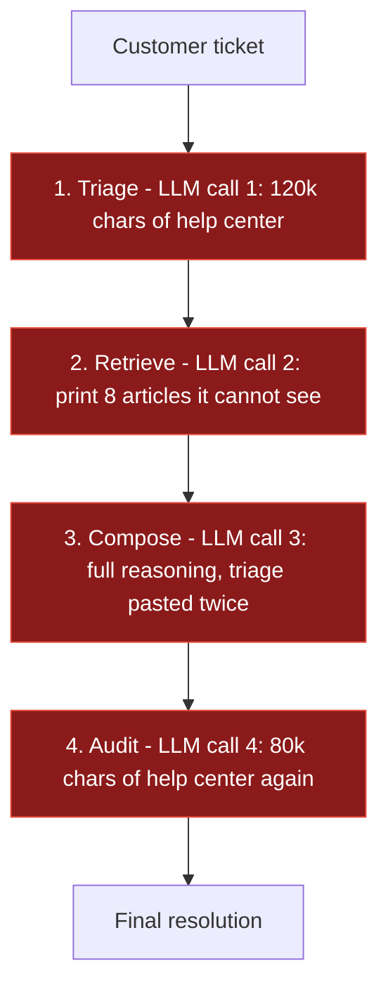
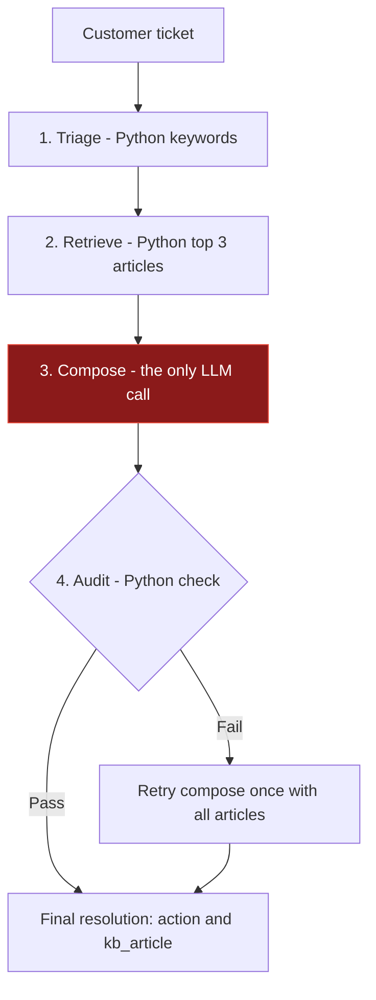

## Question 2 — architecture, before and after

### Before: four LLM calls per ticket

```mermaid
flowchart TD
    A["Customer ticket"] --> B["1. Triage - LLM call 1: 120k chars of help center"]
    B --> C["2. Retrieve - LLM call 2: print 8 articles it cannot see"]
    C --> D["3. Compose - LLM call 3: full reasoning, triage pasted twice"]
    D --> E["4. Audit - LLM call 4: 80k chars of help center again"]
    E --> F["Final resolution"]

    classDef llm fill:#8b1a1a,stroke:#e74c3c,color:#ffffff
    class B,C,D,E llm
```

### After: one LLM call per ticket

```mermaid
flowchart TD
    A["Customer ticket"] --> B["1. Triage - Python keywords"]
    B --> C["2. Retrieve - Python top 3 articles"]
    C --> D["3. Compose - the only LLM call"]
    D --> E{"4. Audit - Python check"}
    E -->|Pass| F["Final resolution: action and kb_article"]
    E -->|Fail| G["Retry compose once with all articles"]
    G --> F

    classDef llm fill:#8b1a1a,stroke:#e74c3c,color:#ffffff
    class D llm
```
